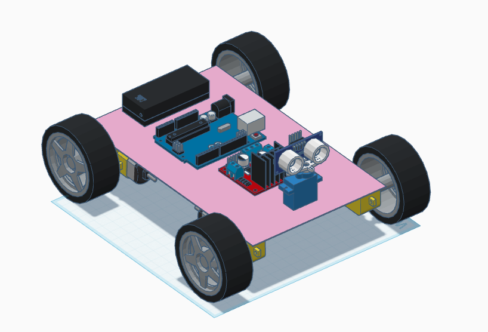
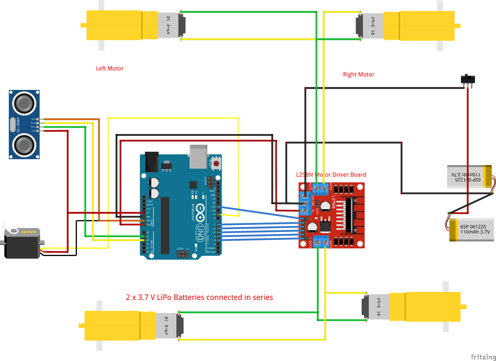

# 🤖 Object Avoidance Robot

An **autonomous robot car** built using Arduino, ultrasonic sensors, and a motor driver module to detect and avoid obstacles in its path. This project demonstrates the use of **sensors, actuators, and control logic** in robotics.

---

## 📌 Features
- Uses **ultrasonic sensor (HC-SR04)** to detect obstacles.  
- Avoids collisions by **stopping and turning** when an obstacle is detected.  
- Controlled via **Arduino UNO**.  
- **DC motors + L298N motor driver** for movement.  
- Powered by **2 × 3.7V Li-ion batteries** connected in series.  
- Compact design for robotics projects and DIY learning.  

---

## 🛠️ Components Required
- 1 × Arduino UNO  
- 1 × L298N Motor Driver Board  
- 2 × DC Geared Motors (left & right wheels)  
- 1 × Ultrasonic Sensor (HC-SR04)  
- 1 × Servo Motor (to rotate ultrasonic sensor)  
- 2 × 3.7V Li-ion batteries (connected in series for ~7.4V)  
- Connecting wires, chassis, wheels, and switch  

---

## ⚡ Circuit Diagram
The complete wiring diagram is shown below:

---

---

## 🔧 How It Works
1. **Ultrasonic Sensor** continuously scans the front using the servo motor.  
2. If the distance is **greater than a safe threshold (e.g., 20cm)** → Robot moves forward.  
3. If an **obstacle is detected** →  
   - Robot stops.  
   - Scans left & right directions using the servo-mounted ultrasonic sensor.  
   - Turns in the direction with more free space.  

---

## 🚀 Getting Started

### 1️⃣ Install Arduino IDE
- Download from [Arduino official website](https://www.arduino.cc/en/software).  

### 2️⃣ Upload the Code
- Open `obs_avd.ino` in Arduino IDE.  
- Select **Board: Arduino UNO**.  
- Select the correct **COM port**.  
- Click **Upload**.  

### 3️⃣ Assemble the Circuit
- Follow the wiring in `object_avoidance_bb.png`.  
- Place robot on flat surface.  

### 4️⃣ Run the Robot
- Switch on the power supply (2 × 3.7V LiPo in series).  
- Robot will now move forward and avoid obstacles autonomously.  

---

## 📜 Code Explanation
Key parts of the Arduino sketch (`obs_avd.ino`):  

- **Motor control**: Forward, backward, left, right, stop functions using L298N.  
- **Ultrasonic distance measurement**: `pulseIn()` used to measure echo return time.  
- **Servo scanning**: Rotates ultrasonic sensor to left and right.  
- **Decision making**: Based on distance values, robot decides where to turn.  

---

## 🧩 Possible Improvements
- Add **IR sensors** for edge detection.  
- Use **PID control** for smoother turns.  
- Upgrade power system for longer runtime.  
- Add **Bluetooth/WiFi control** for manual override.  
- Use **Li-ion 18650 cells** for better battery life.  

---

## 🎯 Applications
- Robotics learning project.  
- Obstacle avoiding car demo.  
- Autonomous navigation experiments.  
- STEM education for beginners.  

---

## 📜 License
This project is open-source under the **MIT License**.  
Feel free to use, modify, and share!  
